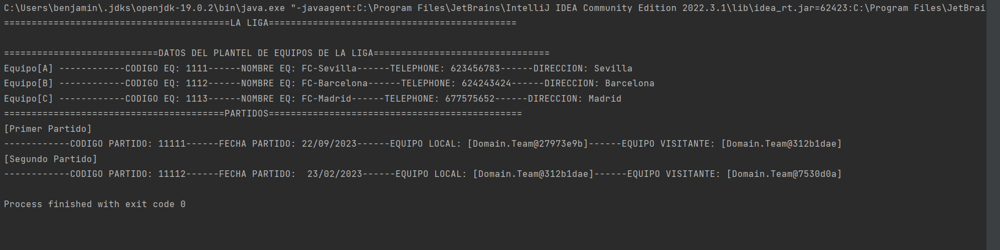

## Description de la tarea

<!-- Digitalizacion de un sistema para automatizar las tareas de LaLiga. se a creado datos de prueba -->

## ¿Cómo se ha implementado?

<!-- Se modelo cada una de las entidades que hay en el sistema -->

## Keywords

<!-- Diagrama de clases, atributos, clases, main, etc... -->

## Screenshots or Video

<!--  -->
<!--  -->
